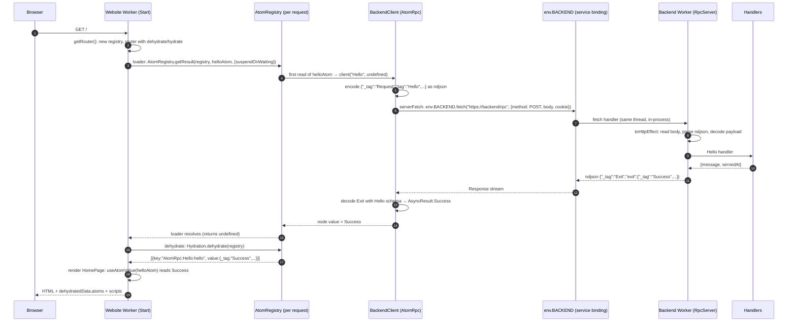
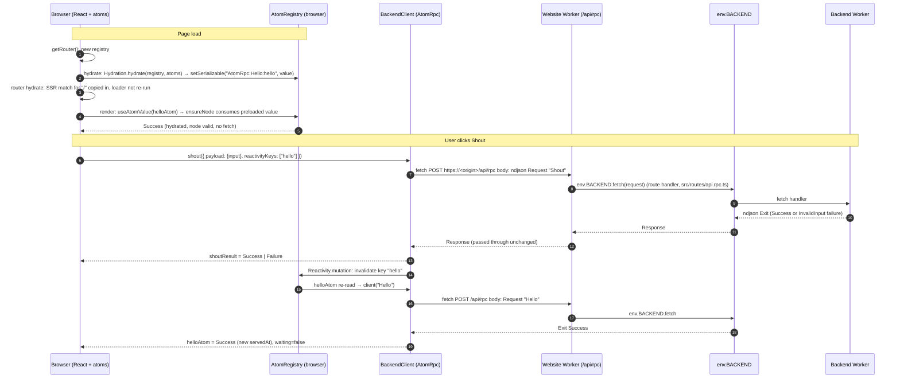
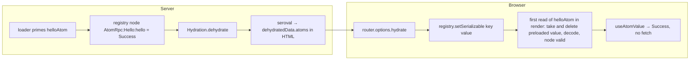

# Research: how loaded data reaches the page, and whether the browser should talk to the Backend directly

Date: 2026-10-10  
Status: complete. All questions answered (§10). Implementation: [plan](./query-pattern-and-proxy-hardening-plan.md).  
Versions: Alchemy `2.0.0-beta.81`, Effect `4.0.1`, `@effect/atom-react` `4.0.1`, `@tanstack/react-start` `1.168.60`.  
Vocabulary: [glossary](./glossary.md). Background: [IPC research](./start-to-effect-worker-ipc-research.md), [IPC plan](./start-to-effect-worker-ipc-plan.md), [Worker split](./tanstack-start-alchemy-worker-split-research.md).

Every claim below was checked against the code in `src/`, the installed Effect source in `node_modules/effect/src`, the Alchemy source in `node_modules/alchemy/src`, the pinned TanStack sources in `refs/tan-start` and `refs/tan-router`, and the Cloudflare docs in `refs/cloudflare-docs`. File and line anchors are given so you can verify.

**Review (2026-10-10, second pass).** Every anchor was re-opened. The conclusions stand, and none of the corrections below change the recommendation:

- SSR order: `dehydrate` runs after the loaders and **before** React render, not after it. Fixed in the §3 diagram and call tree.
- On hydration the browser does **not** re-run the `/` loader. TanStack copies the server match in as-is. The no-refetch outcome is the same, but the mechanism was described wrong in §2.5, §4 and §5.
- A `Failure` from SSR **is** dehydrated and shipped. Before, §5 said only `Success` is.
- The hydrated value is used **once**. If the node is later removed and re-created, it refetches. Added to §2.5 and §4.
- A WebSocket upgrade does **not** pass through the current proxy route. It is a GET, and the route only has `POST`. Fixed in §7.2 and Q2.
- Option B is confirmed: a Route takes precedence over a Custom Domain on the same hostname. Added to §7.2.
- Three line anchors fixed: `alchemy.run.ts:19`, `src/backend/worker.ts:20-24`, `AtomRpc.ts:238`.

## Summary

- **Yes, it is Effect RPC.** The Backend serves `BackendRpcs` with `RpcServer.toHttpEffect` over HTTP, newline-delimited JSON (ndjson). The Website calls it with `RpcClient.layerProtocolHttp`. There is no TanStack server function anywhere in the data path.
- **One client, two transports.** `BackendClient` is an `AtomRpc.Service`. During SSR its `fetch` is the service binding `env.BACKEND.fetch`. In the browser its `fetch` is the real `fetch` to the same-origin proxy route `/api/rpc`, which forwards to the same binding.
- **"Loaded data" is not loader data.** The route loader returns nothing. It primes the `helloAtom` in a per-request `AtomRegistry`. The router dehydrates that registry into the HTML and hydrates it in the browser. The component reads the atom, not `useLoaderData`.
- **Per page view: one Backend call.** SSR makes one. The browser does not refetch after hydration because the serializable query atom is restored as valid. A `Shout` mutation makes one call plus one `Hello` refetch through reactivity keys.
- **Direct browser-to-Backend is possible but not worth doing now.** It needs a custom domain (a Workers Route cannot exist on `workers.dev`), makes the Backend internet-facing before auth exists, and breaks `alchemy dev` parity. The proxy hop costs no extra billed request, no network latency, and about a millisecond of Website CPU. The measurable gain is near zero.
- **Recommendation:** keep the proxy. Revisit only after a custom domain exists _and_ a `cf o11y` measurement shows the Website's share of `/api/rpc` time matters, or when a requirement appears that the proxy cannot carry. Decisions are in §10; the implementation plan is linked in the header.

## 1. The pieces

| File                          | Role                                                                                         | Runs in                   |
| ----------------------------- | -------------------------------------------------------------------------------------------- | ------------------------- |
| `src/api/backend.ts`          | API definition: `BackendRpcs` with `Hello` and `Shout`, `InvalidInput`, schemas only.        | Backend, Website, browser |
| `src/backend/handlers.ts`     | `BackendRpcs.toLayer({...})`: the procedure implementations.                                 | Backend                   |
| `src/backend/worker.ts`       | `Cloudflare.RpcWorker` whose `fetch` is `RpcServer.toHttpEffect(BackendRpcs)` with ndjson.   | Backend                   |
| `alchemy.run.ts`              | `Website.Vite` with `env: { BACKEND: Backend }`: the service binding.                        | Deploy time               |
| `src/env.server.ts`           | Proxy over `cloudflare:workers` env. Server-only by filename.                                | Website                   |
| `src/backend-client.ts`       | `BackendClient` (`AtomRpc.Service`), isomorphic URL and transport, `helloAtom`, `shoutAtom`. | Website, browser          |
| `src/routes/api.rpc.ts`       | `POST /api/rpc` → `env.BACKEND.fetch(request)`. The proxy route.                             | Website                   |
| `src/router.tsx`              | Per-request `AtomRegistry`, `Wrap` provider, router `dehydrate`/`hydrate`.                   | Website, browser          |
| `src/routes/index.tsx`        | Loader primes `helloAtom` with `AtomRegistry.getResult`.                                     | Website, browser          |
| `src/components/HomePage.tsx` | `useAtomValue(helloAtom)`, `useAtom(shoutAtom)`.                                             | Website (render), browser |

## 2. Mechanisms, one by one

### 2.1 Effect RPC: `RpcGroup`, `RpcServer`, `RpcClient`

- **Definition.** `RpcGroup.make(Rpc.make("Hello", { success }), Rpc.make("Shout", { payload, success, error }))` in `src/api/backend.ts:23`. A procedure is a tag plus schemas. Both Workers and the browser import this file.
- **Server.** `RpcServer.toHttpEffect(group)` (`node_modules/effect/src/rpc/RpcServer.ts:1286`) returns an `HttpEffect`: an Effect that reads the current `HttpServerRequest`, parses the body with the configured `RpcSerialization`, dispatches each `Request` message to the handler from `BackendRpcs.toLayer`, and streams `Exit` messages back. `makeProtocolWithHttpEffect` (`RpcServer.ts:1061`) reads the whole request body as text, feeds it to the ndjson parser, and writes responses to a queue that becomes the response body.
- **Client.** `RpcClient.layerProtocolHttp({ url })` (`node_modules/effect/src/rpc/RpcClient.ts:1030`) wraps an `HttpClient` with `prependUrl(url)` and builds `makeProtocolHttp` (`RpcClient.ts:920`). Its `send` (`RpcClient.ts:941`) encodes one `Request` message, does `client.post("", { body })`, and decodes the streamed response chunks into `Exit` messages.
- **Serialization.** `RpcSerialization.layerNdjson` (`node_modules/effect/src/rpc/RpcSerialization.ts:610`), content type `application/ndjson`, one JSON object per line. Both ends use it. It `includesFraming`, so the client reads the response as a stream rather than one text body.
- **Validation is automatic.** The server decodes the payload with the procedure's `payload` schema and encodes the `Exit` with `success` and `error` schemas. The client does the reverse. Nobody in `src/` calls `Schema.decode` by hand. Defects round-trip as `Schema.Defect`.

### 2.2 Wire format

One `Shout` call over the wire. Request body, one line:

```json
{
  "_tag": "Request",
  "id": "1",
  "tag": "Shout",
  "payload": { "input": "hello" },
  "headers": [],
  "traceId": "...",
  "spanId": "...",
  "sampled": false
}
```

Response body, one line:

```json
{
  "_tag": "Exit",
  "requestId": "1",
  "exit": { "_tag": "Success", "value": { "input": "hello", "output": "HELLO" } }
}
```

A typed failure is `{"_tag":"Failure","cause":[{"_tag":"Fail","error":{"_tag":"InvalidInput","message":"..."}}]}` in the `exit` field. Shapes: `RequestEncoded` at `node_modules/effect/src/rpc/RpcMessage.ts:71`, `ResponseExitEncoded` at `RpcMessage.ts:313`. The HTTP method is always POST and the path is ignored by `RpcServer`; only the body matters.

### 2.3 The service binding

`env: { BACKEND: Backend }` in `alchemy.run.ts:19` makes `env.BACKEND` a `Fetcher` in the Website. Calling `env.BACKEND.fetch(request)` invokes the Backend's `fetch` handler in-process. Per Cloudflare's docs, both Workers run on the same thread of the same server, the hop adds no network latency, and it is not billed as a second request (`refs/cloudflare-docs/src/content/docs/workers/platform/pricing.mdx:304-316`, `workers/runtime-apis/bindings/service-bindings/index.mdx:22-24`). Two caveats. The free-request rule applies only on Workers Standard pricing; the deprecated Bundled and Unbound plans count two requests (`pricing.mdx:312-314`). And "same thread" holds only "by default": Smart Placement can change it (§7.3). The binding ignores the request's host, which is why the SSR URL can be the placeholder `https://backend/rpc`.

### 2.4 `AtomRpc.Service`: atoms around the RPC client

`AtomRpc.Service` (`node_modules/effect/src/reactivity/AtomRpc.ts:135`) builds, from a group and a protocol layer:

- An `Atom.runtime` holding the `RpcClient` built by `RpcClient.make(group, { flatten: true })` with the protocol layer provided.
- `query(tag, payload, options)` (`AtomRpc.ts:262`): an `Atom<AsyncResult<Success, Error | RpcClientError>>`. Reading it runs `client(tag, payload)` inside the runtime. Options: `serializationKey` wraps it in `Atom.serializable` with key `AtomRpc:<tag>:<key>` and an `AsyncResult.Schema` built from the procedure's own schemas; `timeToLive` becomes `Atom.setIdleTTL`.
- `mutation(tag)` (`AtomRpc.ts:195`): an `AtomResultFn`. Calling it with `{ payload, reactivityKeys }` runs the procedure and, on success, `Reactivity.mutation` invalidates every atom registered under those keys. The mutation atom is also `Atom.serializable`, with key `AtomRpc:mutation:<tag>`. It is never read during SSR, so nothing is dehydrated for it.

Our atoms (`src/backend-client.ts:42-47`):

```ts
helloAtom = BackendClient.query("Hello", undefined, {
  serializationKey: "hello",
  timeToLive: "1 minute",
}).pipe(Atom.withReactivity(["hello"]));
shoutAtom = BackendClient.mutation("Shout");
```

The reactivity wrapper is outside the serializable query on purpose: the inner node is the one dehydrated and hydrated, and hydration sets it valid, so no refetch after SSR. A mutation with `reactivityKeys: ["hello"]` still invalidates it (IPC research C1 and C2).

### 2.5 The registry, hydration, and the router

- **One `AtomRegistry` per request.** `getRouter()` (`src/router.tsx:7`) runs once per SSR request and once in the browser (`refs/tan-start/packages/start-server-core/src/createStartHandler.ts`), and creates the registry inside it. `Wrap` puts it in `RegistryContext` so hooks find it. `context: { registry }` gives loaders access.
- **Loader primes.** `AtomRegistry.getResult(registry, helloAtom, { suspendOnWaiting: true })` (`node_modules/effect/src/reactivity/AtomRegistry.ts:341`) subscribes to the atom, which triggers the RPC call, and waits until the `AsyncResult` stops waiting. It then resumes with `Result.toExit(result)` (`AtomRegistry.ts:384-393`). So a `Success` resolves the Effect, and a `Failure` fails it, which makes `runPromise` reject. The loader awaits that and returns nothing.
- **Dehydrate.** Start awaits `router.load()` (loaders), then calls `serverSsr.dehydrate()` (`createStartHandler.ts:733-746`), and only then renders React (about lines 757-766). That call invokes invokes our router option `dehydrate: () => ({ atoms: Hydration.dehydrate(registry) })`. `Hydration.dehydrate` (`node_modules/effect/src/reactivity/Hydration.ts:80`) walks the registry's nodes, keeps those marked `Atom.serializable`, encodes their values with the atom's schema, and returns `[{ key: "AtomRpc:Hello:hello", value: { _tag: "Success", ... }, dehydratedAt }]`. Start serializes that into the HTML with seroval as `dehydratedData`.
- **Hydrate.** In the browser, the router calls `options.hydrate(dehydratedData)` before matching routes (`refs/tan-router/packages/router-core/src/load-client.ts:2226`). Our `hydrate` calls `Hydration.hydrate(registry, atoms)` (`Hydration.ts:152`), which does `registry.setSerializable(key, value)` per entry. That only stores the value in a `preloadedSerializable` map (`AtomRegistry.ts:535-537`). When `helloAtom` is first read in the browser, `ensureNode` (`AtomRegistry.ts:588-612`) takes the value, **deletes it from the map**, decodes it, and calls `setValue`, which marks the node valid (`AtomRegistry.ts:949-954`). So the hydrated value is used once. If the node is later removed (idle TTL) and re-created, the atom refetches.
- **The browser loader does not run on hydration.** TanStack's client `hydrate()` (`load-client.ts`, around lines 2294-2480) copies each successful SSR match in as-is: status, `loaderData`, and context. It runs a client load only when `needsClientLoad` is set, which means a pending boundary or a mismatch. The source comment says the client does this "without granting its beforeLoad or loader any hydration authority". The first browser read of `helloAtom` happens in `HomePage` render, not in the loader.
- **`timeToLive` is a margin, not a requirement.** With `defaultIdleTTL: 400` in `router.tsx`, every node already waits 400 ms after its last subscriber before it is removed (`AtomRegistry.ts:582-584`). Dehydrate runs right after `router.load()`, so 400 ms is very likely enough. `timeToLive: "1 minute"` removes the race entirely (IPC research C12), and it also keeps the value cached for later client navigation.

### 2.6 `createIsomorphicFn`: one module, two bodies

`rpcUrl` and `transport` in `src/backend-client.ts:12-28` are `createIsomorphicFn().client(...).server(...)`. The Start compiler keeps only the matching body per build. The server body references `env` from `src/env.server.ts` and `getRequestHeader`, both pruned from the client bundle. Start's import protection fails the client build if a `*.server.*` import survives (IPC research C8; verified in the plan's step 9: nothing from `cloudflare:workers` or `env.server` in `dist/client`).

## 3. Server path: an SSR page view



### Call tree (SSR)

```
Start fetch handler                                   refs/tan-start/.../createStartHandler.ts
└─ getRouter()                                        src/router.tsx:7
   ├─ AtomRegistry.make({ scheduleTask, defaultIdleTTL: 400 })
   └─ createRouter({ context: { registry }, Wrap, dehydrate, hydrate })
└─ router.load()                                      createStartHandler.ts:733
   └─ Route "/" loader                                src/routes/index.tsx:11
      └─ AtomRegistry.getResult(registry, helloAtom, { suspendOnWaiting: true })   effect/.../AtomRegistry.ts:341
         └─ registry.subscribe(helloAtom)  → withReactivity wrapper → inner serializable query
            └─ self.runtime.atom(self.use(client => client("Hello", undefined)))   effect/.../AtomRpc.ts:238
               └─ RpcClient flat client → Protocol.send                          effect/.../RpcClient.ts:941
                  ├─ serialization.makeUnsafe().encode(Request)   (ndjson)
                  └─ HttpClient.post("", { body })  with prependUrl("https://backend/rpc")
                     └─ FetchHttpClient.Fetch = serverFetch       src/backend-client.ts:17
                        ├─ headers.set("cookie", getRequestHeader("cookie"))
                        └─ env.BACKEND.fetch(input, { ...init, headers })        src/env.server.ts:6 → cloudflare:workers
                           └─ Backend Worker fetch                                src/backend/worker.ts:20-24
                              └─ RpcServer.toHttpEffect(BackendRpcs)              effect/.../RpcServer.ts:1286
                                 ├─ makeProtocolWithHttpEffect: request.text → parser.decode   RpcServer.ts:1061
                                 ├─ decode payload with Rpc schema
                                 ├─ BackendHandlers.Hello                          src/backend/handlers.ts:6
                                 └─ encode Exit → queue → streamed Response body
                  └─ Stream.runForEachArray(response.stream, decode) → writeResponse(Exit)
            └─ AsyncResult.Success stored on the inner node
└─ serverSsr.dehydrate()                              createStartHandler.ts:746
   └─ router.options.dehydrate()                      src/router.tsx:18
      └─ Hydration.dehydrate(registry)                effect/.../Hydration.ts:80
         └─ for each Atom.serializable node not Initial: encode value with AsyncResult.Schema(Hello, errors)
└─ render <HomePage/>                                 createStartHandler.ts:~757  src/components/HomePage.tsx:35  useAtomValue(helloAtom)
└─ HTML response with dehydratedData.atoms
```

## 4. Browser path: hydration, navigation, and a mutation



### Call tree (browser, mutation)

```
Button onClick                                        src/components/HomePage.tsx:89
└─ shout({ payload: { input }, reactivityKeys: ["hello"] })      useAtom(shoutAtom)
   └─ AtomResultFn from self.runtime.fn                effect/.../AtomRpc.ts:195
      └─ Reactivity.mutation(client("Shout", payload), ["hello"])   effect/.../Reactivity.ts:248
         └─ Protocol.send (makeProtocolHttp)            effect/.../RpcClient.ts:941
            └─ HttpClient.post("", { body })  with prependUrl(`${window.location.origin}/api/rpc`)
               └─ FetchHttpClient.layer → globalThis.fetch
                  └─ Website: server route POST /api/rpc   src/routes/api.rpc.ts:8
                     └─ env.BACKEND.fetch(request)        (raw Request forwarded, body streamed)
                        └─ Backend: RpcServer.toHttpEffect → BackendHandlers.Shout   src/backend/handlers.ts:12
            └─ decode Exit → shoutResult
         └─ on Success: registry invalidates atoms registered under "hello"
            └─ helloAtom (withReactivity wrapper) marks inner query stale → re-run client("Hello") → same path
```

### Call tree (browser, client-side navigation back to `/`)

This is the path once a second route exists, with the current await-only loader. §9.3 proposes a stale-while-revalidate loader that changes the "node alive" branch.

```
router.navigate("/")
└─ Route "/" loader                                   src/routes/index.tsx:11
   └─ AtomRegistry.getResult(registry, helloAtom)
      ├─ inner query node alive (left /, came back within its 1-minute timeToLive) → resolves immediately
      └─ node gone → client("Hello") over fetch → /api/rpc → binding → Backend
         (the SSR value was consumed on first read, so it is not reused)
```

The `withReactivity` wrapper has no TTL of its own (`removeTtl`). It goes away 400 ms after `HomePage` unmounts. The inner serializable query keeps its 1-minute idle TTL.

## 5. Hydration in detail



Two details worth knowing:

- The dehydrated value is the encoded `AsyncResult`, failures included. `Hydration.dehydrate` skips only `Initial` values, and values whose schema encode fails (`Hydration.ts:52-62`, `92-121`). If `Hello` fails during SSR, the loader rejects and the match errors, but `router.load()` still completes and dehydrate still runs. The browser therefore receives both the `Failure` value and an errored match, and the route error boundary shows. It does not refetch on load.
- `Hydration.dehydrate` runs before React render, so it only sees atoms read during the loader phase. An atom first read during render would not be captured. The server would render it as `Initial`, and the browser would fetch it. Prime every SSR-rendered query in a loader.

## 6. Where time and money go today

Per browser page view of `/`:

| Step                                  | Billed request | Network hop | CPU                                     |
| ------------------------------------- | -------------- | ----------- | --------------------------------------- |
| `GET /` to Website                    | 1              | 1           | Start routing, loader, React SSR        |
| Website → Backend via binding (Hello) | 0              | 0           | Backend handler, ndjson encode/decode   |
| Asset requests                        | per asset      | per asset   | served by the assets binding, no Worker |

Per browser mutation:

| Step                                   | Billed request | Network hop | CPU                                                |
| -------------------------------------- | -------------- | ----------- | -------------------------------------------------- |
| `POST /api/rpc` to Website             | 1              | 1           | Start route match plus `env.BACKEND.fetch`. Small. |
| Website → Backend via binding (Shout)  | 0              | 0           | Backend handler                                    |
| Refetch `Hello` (same two steps again) | 1              | 1           | same                                               |

The Website's work on `/api/rpc` is: match the server route, call the binding, return the Response object. No body parsing, no serialization. On Workers Standard pricing CPU time is billed per millisecond, so this hop's cost is on the order of one CPU-millisecond per call. Cold starts: the Website just served the page in the colo the user is talking to, so it is very likely warm. This is likely, not guaranteed: a later request can land on a different machine in that colo.

## 7. Can the browser talk to the Backend directly?

### 7.1 What exists today

Nothing. The Backend has `workersDev: false` and no route or domain (`src/backend/worker.ts:15`), so it has no public URL at all. The only entry point is the binding. `RpcServer.toHttpEffect` has no CORS handling and no auth middleware attached (`CurrentUserMiddleware` is declared but not attached, `src/api/backend.ts:12-21`).

### 7.2 Options

```mermaid
flowchart TB
    subgraph A["A. Today: same-origin proxy"]
        A1[Browser] -->|POST /api/rpc| A2[Website]
        A2 -->|binding| A3[Backend]
    end
    subgraph B["B. Workers Route on a custom domain"]
        B1[Browser] -->|POST example.com/api/rpc| B3[Backend]
        B1 -->|GET /| B2[Website]
        B2 -->|binding, SSR| B3
    end
    subgraph C["C. Backend subdomain + CORS"]
        C1[Browser] -->|POST api.example.com/rpc| C3[Backend]
        C1 -->|GET /| C2[Website]
        C2 -->|binding, SSR| C3
    end
    subgraph D["D. Backend in front"]
        D1[Browser] -->|everything| D3[Backend]
        D3 -->|binding, non-API paths| D2[Website]
    end
```



| Option                                             | Needs                                                                                                                                                | Browser → data path                                                                      | Keeps `alchemy dev` parity                           | Backend exposed           | Verdict                                        |
| -------------------------------------------------- | ---------------------------------------------------------------------------------------------------------------------------------------------------- | ---------------------------------------------------------------------------------------- | ---------------------------------------------------- | ------------------------- | ---------------------------------------------- |
| **A. Proxy (today)**                               | nothing                                                                                                                                              | 1 request, 2 Workers, same thread                                                        | yes                                                  | no                        | **keep**                                       |
| **B. Workers Route** `example.com/api/*` → Backend | a Cloudflare zone, DNS, Alchemy `routes` on the Backend (`node_modules/alchemy/src/Cloudflare/Workers/Worker.ts:835`), a Vite `server.proxy` for dev | 1 request, 1 Worker                                                                      | no (routes are not emulated in dev; IPC research §7) | yes, same origin, no CORS | revisit with a custom domain and a measurement |
| **C. Subdomain + CORS**                            | zone, `HttpMiddleware.cors` (`node_modules/effect/src/http/HttpMiddleware.ts:347`), `SameSite=None` cookies                                          | 1 request plus a preflight for non-simple requests                                       | no                                                   | yes, cross-site           | avoid                                          |
| **D. Backend in front**                            | Backend gets the domain, proxies non-API paths to Website                                                                                            | API: 1 Worker. Pages and assets: 2 Workers, and assets lose the free assets-binding path | no                                                   | yes                       | avoid                                          |
| **E. One Worker** (Effect inside Start)            | drop `RpcWorker`, host handlers in Start                                                                                                             | 1 Worker                                                                                 | yes                                                  | n/a                       | tabled (D12)                                   |

Notes on B, the only serious candidate:

- **Routing works as intended.** Put the Website on a Custom Domain `example.com` (Alchemy's `domain` prop, `Worker.ts:828`) and the Backend on the Route `example.com/api/*`. Requests to `/api/*` then reach the Backend, and everything else reaches the Website. Cloudflare: Routes "take precedence if configured on the same hostname" as a Custom Domain (`refs/cloudflare-docs/src/content/docs/workers/configuration/routing/routes.mdx:21`). The worked example is at `custom-domains.mdx:139-142`.
- The API definition, `BackendClient`, atoms, hydration, and SSR transport do not change. Only `rpcUrl().client` changes (to `/api/rpc` on the custom domain, which routes to the Backend) and the proxy route becomes unused. The SSR path keeps using the binding.
- The Backend becomes internet-facing. It must then carry auth, rate limiting, and body-size limits itself. That is where auth was going to live anyway (D8), but today there is none, so B would expose an unauthenticated procedure surface.
- Dev: `alchemy dev` does not emulate Workers Routes. The browser would need a Vite `server.proxy` from `/api/rpc` to the local Backend's port, so the dev and production routing diverge.
- Version skew: today a `/api/rpc` call always lands on whatever Backend the running Website is bound to. With B the browser bundle and the Backend are deployed separately with no link, so an old bundle in an open tab can call a new Backend. D2's boundary validation already covers this, but it becomes a real path instead of a theoretical one.
- Streaming and WebSockets are not a reason to go direct, but WebSockets would need a route change.
  - Start returns a handler's `Response` object unchanged (`refs/tan-start/packages/router-core/src/ssr/handlerCallback.ts:38-48, 100-143`). So a streaming ndjson body on `POST` passes through today.
  - A WebSocket upgrade does **not** pass through the route as written. An upgrade is a `GET`, and Start picks `handlers[method] ?? handlers.ANY` (`createStartHandler.ts:996-999`). With only `POST` defined, the upgrade falls to the SSR render (`createStartHandler.ts:965-966`), or gets a 406 if `Accept` excludes HTML. Start has no upgrade handling of its own.
  - The fix would be a `GET` (or `ANY`) handler that returns `env.BACKEND.fetch(request)`. A 101 `Response` would then come back unchanged. The Backend would also need a WebSocket protocol (`RpcServer.toHttpEffectWebsocket`, `RpcServer.ts:1330`). `toHttpEffect` alone does not upgrade. A WebSocket through this proxy is still untested.

### 7.3 Does direct access make it faster?

Marginally, and not measurably for this app.

- **Network latency: no change.** The browser makes one request either way, to the same Cloudflare colo. The binding hop is in-process on the same thread.
- **CPU: saves the Website's share** of each API call. That is route matching and one `fetch` call forwarding a `Request` object, roughly a millisecond.
- **Cold start: saves a Website cold start** only when the Website isolate is cold but the Backend is warm. After a page view both are warm in that colo. For a client-only navigation after a long idle, both are cold either way, and B saves one of two cold starts, each typically single-digit milliseconds on Workers.
- **Smart Placement** would change this picture if enabled: with placement the Backend could run near a database while the Website stays at the edge, and then the binding hop could cross regions. Neither Worker has `placement` set (`Worker.ts:719` is the prop). Not relevant today.

### 7.4 Does it reduce cost?

No in any meaningful way.

- **Requests:** one billed request per browser call in both A and B. Service binding calls are free (`pricing.mdx:304-316`).
- **CPU time:** B saves the Website's millisecond per call. At Workers Standard rates that is about two cents per million calls.
- **Added cost for B:** a zone (if you do not already have one), and the engineering and review time for an internet-facing Backend with auth and limits.

### 7.5 Is it a good architecture?

The current shape is the one recommended by Alchemy's examples, the surveyed community repos, and the earlier research (D10, D12): a thin Website that owns the origin, a private Backend reached only by binding. It gives you:

- One public surface. The Backend's attack surface is the Website's routes.
- One place to set cookies and headers for the browser.
- Identical topology in dev, staging, and production.
- Freedom to change the Backend's transport (ndjson today, JSON RPC, native Worker RPC, a WebSocket protocol) without touching what the browser sees.

Going direct trades those for a saving you cannot measure with this traffic. The one architectural argument for B is that a Workers Route makes Start a pure page renderer with no data responsibilities. That is tidy, but the proxy route is one line of handler and carries no logic, so there is little to gain.

**Recommendation: keep A.** Record B as the known upgrade path. The trigger to revisit is all three of:

1. A custom domain exists for the stage in question.
2. Auth and rate limiting are live in the Backend.
3. A `cf o11y telemetry query` on staging shows the Website's wall or CPU time on `/api/rpc` is a meaningful share of API latency, or the Website cold-starts on API calls often enough to notice.

Until then, better levers for speed are fewer calls (coalesce procedures, keep `timeToLive` sensible, keep the one-call-per-SSR shape) and smaller bundles (the client chunk is 657 kB minified, noted in the plan's Issues), not fewer hops.

## 8. Small things worth fixing on the current path

Not part of the question, but noticed while tracing. None are urgent.

- **`/api/rpc` accepts any body.** An empty body makes the Backend log an error and return 500 (plan Issues). A content-type check (`application/ndjson`) and a body size cap in the route handler would reject junk before it reaches the Backend. Cheap, and it also matters if B ever happens, since the Backend would need the same guards.
- **`GET /api/rpc` falls through to the app render** (`createStartHandler.ts:965-966, 996-999`): with no matching method handler, Start renders the app. That is the 200 HTML shell, or a 406 if `Accept` excludes HTML. Harmless, but a `GET` handler returning 405 would be clearer. This was checked in the source only; the dev server was not running for a live probe.
- **Trace propagation.** The client sends `traceId`/`spanId` inside the ndjson message, not as a `traceparent` header, so the Website's own request logs cannot be joined to the Backend's spans by header. Fine for now; relevant when telemetry is wired up.

## 9. Choosing `timeToLive` for a query atom

You asked (Q8) what `timeToLive` should be from first principles. This section starts from what the setting does in the code.

### 9.1 What the setting does

- **It is an idle TTL, not a freshness bound.** `timeToLive` becomes `Atom.setIdleTTL` (`AtomRpc.ts:253-257`). The registry starts the timer only when the last subscriber leaves: `removeNode` → `setNodeTimeout` (`AtomRegistry.ts:645-683`). A re-subscribe cancels it (`removeNodeTimeout`). While `HomePage` is mounted, the node has a subscriber, so the TTL never runs.
- **Nothing refreshes a mounted query.** There is no `staleTime` or refetch interval. The value changes only on invalidation (`reactivityKeys`), an explicit `refresh`, or an opt-in wrapper like `Atom.refreshOnWindowFocus` (`Atom.ts:2835`). With any TTL, even 0, a page left open shows the value it loaded until something invalidates it.
- **So the TTL decides one thing:** whether coming back to a page within N seconds of leaving it shows the cached value instantly or refetches. The age of the value shown on return can be as high as _time mounted + time away_. It is not capped at the TTL.

### 9.2 Where it does not matter

- **Server.** The registry lives for one request. The TTL only has to outlast the gap between the loader's subscription ending and `dehydrate`, which is sub-millisecond. `defaultIdleTTL: 400` already covers that (§2.5). Anything above 400 ms buys nothing on the server.
- **Hydration.** The hydrated value is consumed on the first render read, regardless of TTL (§2.5).

### 9.3 The pattern for a site with real activity

Treat `Hello` as a stand-in for a typical page query: shared server data that other users and background jobs change, shown on a page users navigate away from and back to. The current setup, an await-only loader plus a fixed TTL, gives a bad trade-off for that data:

- **Short TTL:** every back-navigation waits for a round trip.
- **Long TTL:** back-navigation is instant, but it silently shows data that is minutes old.

The TTL is being asked to do two jobs: placeholder lifetime and freshness. Split them.

**1. Revalidate on navigation (stale-while-revalidate).** Make the loader refresh the query and return without waiting for the refresh when a cached value exists:

```ts
loader: async ({ context: { registry } }) => {
  registry.refresh(helloAtom); // no node: creates it uninitialized, no fetch. Cached node: mark stale.
  await Effect.runPromise(AtomRegistry.getResult(registry, helloAtom)); // suspendOnWaiting: false
},
```

Why this works, from the source:

- `registry.refresh` on the `withReactivity` wrapper delegates to the inner query, because `transform` forwards `refresh` (`Atom.ts`, `transform`).
- An Effect atom re-run returns `AsyncResult.waitingFrom(previous)` (`Atom.ts:699`), which means `Success` with `waiting: true`.
- `getResult` without `suspendOnWaiting` resumes on any non-`Initial` value (`AtomRegistry.ts:384-393`). So navigation completes immediately with the cached value, and the fresh value replaces it about one round trip later. `HomePage` already renders `waiting` as "(refreshing…)".
- With no cached node, as on SSR or after the TTL expired, `refresh` only creates the node (`invalidateAtom` → `ensureNode`, then `invalidate` on an uninitialized node does not build it, `AtomRegistry.ts:624-626`), and `getResult` waits through `Initial` as it does today. One fetch, not two. Hydration is unaffected, because the loader does not run on hydration (§2.5).

Not yet run. The plan verifies it in the dev log.

**2. Then the TTL means only "how long is an old value worth showing as a placeholder?"** Freshness on return is now bounded by one round trip, not by the TTL. So the TTL can be long: **5 minutes** is a sound default. It covers the usual list → detail → back loop and returning from another tab, and memory per query is small.

**3. Catch up long-open tabs with `refreshOnWindowFocus`** (`Atom.ts:2835`). A page left open never refreshes on its own (§9.1). Two constraints:

- It strips `serializable`, so it must wrap _outside_ the query, as `withReactivity` does.
- `windowFocusSignal` touches `window` and `document` when read (`Atom.ts:2788-2800`), so it would throw during SSR. Apply it only in the browser, for example via `createIsomorphicFn`, or with a browser-only wrapper atom.

**4. Our own writes stay on `reactivityKeys`** (§2.4). They are exact and immediate. Nothing above replaces them.

**5. Seconds-fresh data is a push problem.** It belongs to the WebSocket/Durable Object phase (Q2), not polling or a short TTL.

### 9.4 Per-query exceptions

| Query kind                                                                         | Loader                                                   | TTL                                  | Extras                                                  |
| ---------------------------------------------------------------------------------- | -------------------------------------------------------- | ------------------------------------ | ------------------------------------------------------- |
| **Default: shared server data** (lists, detail pages, counts)                      | stale-while-revalidate                                   | 5 minutes                            | `refreshOnWindowFocus` in the browser, `reactivityKeys` |
| **Must never show stale, even briefly** (balances, stock at checkout, permissions) | `refresh` then `getResult` with `suspendOnWaiting: true` | default 400 ms                       | `reactivityKeys`                                        |
| **Session-scoped, changed only by this user** (current user, preferences)          | await once                                               | `keepAlive` (`timeToLive: Infinity`) | `reactivityKeys`; invalidate on sign-in or sign-out     |
| **Live** (presence, chat, live counters)                                           | n/a                                                      | n/a                                  | push over WebSocket (later phase)                       |

Applied to `helloAtom`: it is the default kind. Change it to stale-while-revalidate, with a 5-minute TTL and `refreshOnWindowFocus` in the browser.

## 10. Decisions and open questions

All answered in Plannotator on 2026-10-10. The old Q9 (re-park) was removed.

:::question
Q1. Is a custom domain planned for staging or production, and when?

- [x] No custom domain in the next planning horizon — close this topic and keep the proxy
- [ ] Yes, planned — change nothing now; add the Q4 measurement first
- [ ] Already have one — tell me the zone and I will check which stages use it
:::

:::question
Q2. Will the browser need long-lived connections (streaming subscriptions, WebSockets, live updates)?

Your note: long-lived connections will be a WebSocket to a Durable Object, in a much later phase. For the record, that path does not need a direct route either: a `GET` handler on a Website route forwards the upgrade through a binding (the Backend, or a Durable Object namespace bound to the Website), and the 101 response passes back unchanged (§7.2). The hibernation API keeps idle sockets cheap. Decide the exact hop when that phase starts.

- [x] Not planned — leave the route POST-only
- [ ] Yes — prototype WebSocket through the proxy (add GET handler + websocket protocol) before considering a direct route
- [ ] Yes, and server-push only — use the streaming RPC over POST, no WebSocket
:::

:::question
Q3. Will anything other than our own browser code call the Backend (mobile app, CLI, a partner)?

- [x] No — keep the Backend private (D4 stands)
- [ ] Yes — plan a public `HttpApi` surface with auth as its own piece of work
:::

:::question
Q4. Should we add a staging measurement now?

- [x] Yes, once there is real traffic on staging
- [ ] Yes, now, with synthetic traffic
- [ ] No
:::

:::question
Q5. Harden the proxy route now (content-type check, body-size cap, 405 on GET)?

- [x] Yes, as a small follow-up commit
- [ ] Not yet
:::

:::question
Q6. Enable Smart Placement on the Backend later, when a database arrives?

- [x] Not yet — decide with a measurement when a database exists
- [ ] Yes, plan for it now
:::

:::question
Q7. How should an SSR `Hello` failure look to the visitor?

- [x] Keep the error boundary — simplest, and one query means the page is useless without it anyway
- [ ] Render inline — loader catches, page renders with the atom's Failure branch
:::

:::question
Q8. Adopt the §9.3 query pattern as the project default?

You accepted keeping `timeToLive`, and asked what the value should be. §9.3 argues that the TTL cannot be chosen well on its own: the loader also has to revalidate. If you accept, `helloAtom` becomes the reference implementation, and the §9.4 table becomes the convention for new queries.

- [x] Yes — stale-while-revalidate loader, 5-minute TTL, browser-only refreshOnWindowFocus, reactivityKeys for own writes; §9.4 exceptions per query
- [ ] Partly — stale-while-revalidate and 5-minute TTL, but no focus refresh yet
- [ ] No — keep await-only loader with a fixed TTL; tell me the value

:::
