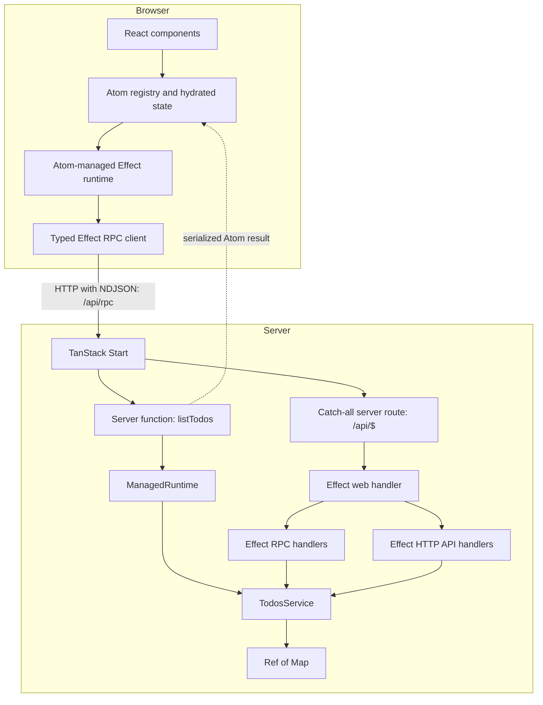
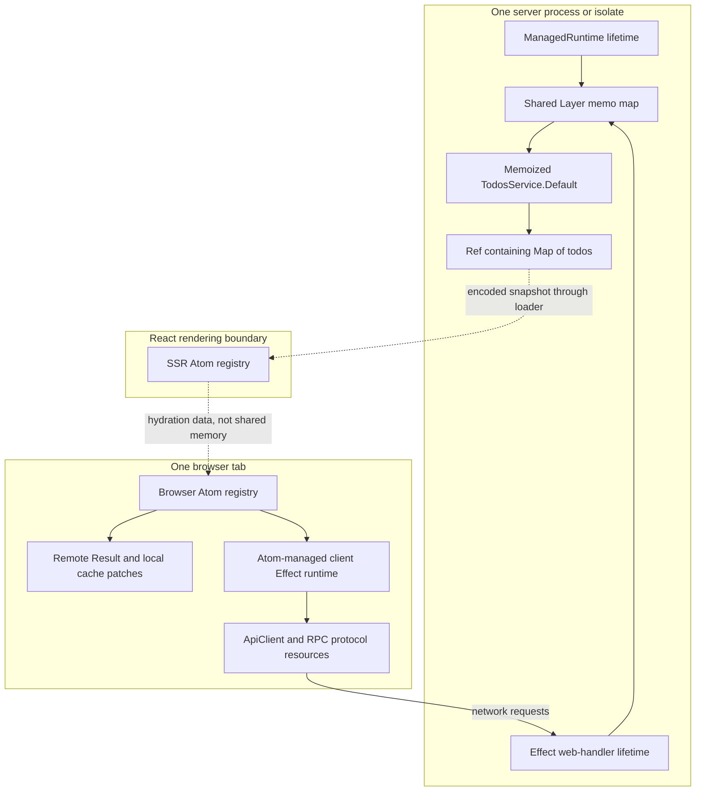

# Research: TanStack Start + Effect + Atoms architecture

Date: 2026-10-07  
Scope: understand the reference architecture and outline a small future experiment; no implementation or migration is proposed as part of this research.

Status: reviewed in Plannotator; decisions recorded below. Parked until we explicitly resume the adoption assessment. No implementation is authorized by this review.

## Executive summary

The reference at `refs/effect-tanstack-start` integrates TanStack Start and Effect through two boundaries:

1. **A TanStack server function loads initial data directly from an Effect service**, then serializes an Atom result for SSR and browser hydration.
2. **A TanStack server route hosts Effect RPC and HTTP API handlers**. Browser-side Effects call RPC over HTTP; Effect Atoms expose the resulting data and mutation state to React.

TanStack Start owns page routing, SSR, server-function transport, and the outer HTTP entry point. Effect owns service composition, domain contracts, API routing, and business operations. Atoms own reactive client data and async state. **TanStack Query is not used by the application.**

The key architectural idea is not “run every operation through a server function.” It is “keep one Effect service layer behind multiple thin entry points, and hydrate an Effect-aware browser state layer from the initial server read.”

### Version aside

The reference manifest declares Effect `^3.19.10`, Start `^1.132.0`, `@effect-atom/atom` `^0.4.8`, and `@effect-atom/atom-react` `^0.4.3`. Our manifest specifies Effect `4.0.1` and Start `1.168.60`.

These are manifest declarations, not a claim that every reference dependency resolves to that exact version. Effect 3 APIs such as `Effect.Service`, separate platform/RPC packages, and the reference Atom APIs must be re-evaluated against Effect 4 before adoption. This document focuses on responsibilities and boundaries, not prescribing those older imports or APIs.

## 1. Evidence and method

Primary evidence is the locally fetched source of `lucas-barake/effect-tanstack-start`, recorded as branch `main`, fetched on 2026-10-07 in `.ref.json`. This is a source inspection, not a runtime test or benchmark. The metadata does not record an immutable commit SHA.

Key files, relative to `refs/effect-tanstack-start/`:

| File                                    | Architectural responsibility                                          |
| --------------------------------------- | --------------------------------------------------------------------- |
| `src/routes/index.tsx`                  | Initial loader, server function, hydration boundary                   |
| `src/routes/__root.tsx`                 | React Atom registry provider                                          |
| `src/routes/-index/atoms.tsx`           | Browser Effect runtime, query atom, mutation atoms, cache updates     |
| `src/api/api-client.ts`                 | Typed RPC and HTTP clients; fetch transport                           |
| `src/api/domain-rpc.ts`                 | RPC method contracts                                                  |
| `src/api/domain-api.ts`                 | REST-style HTTP API contracts                                         |
| `src/api/todo-schema.ts`                | Shared data, input, and error schemas                                 |
| `src/routes/api/$.ts`                   | Start-to-Effect HTTP bridge; server runtime; shared memo map; cleanup |
| `src/routes/api/-lib/todos-service.ts`  | Business operations and in-memory storage                             |
| `src/routes/api/-lib/todos-rpc-live.ts` | RPC-to-service adapter                                                |
| `src/routes/api/-lib/todos-api-live.ts` | HTTP-API-to-service adapter                                           |
| `src/lib/atom-utils.ts`                 | Serializable-atom typing helper and dehydration                       |
| `src/router.tsx`                        | Router setup; no Query integration                                    |
| `vite.config.ts`                        | Nitro hosting integration                                             |

Current TanStack documentation was also checked for the distinction between server functions, route loaders, and server routes. The reference source remains authoritative for what this particular project implements.

## 2. Responsibilities and boundaries



**Atoms are not a network protocol.** They read and execute Effects, track results, and notify React. The RPC client is the network boundary. Likewise, TanStack Query would be a client data-management layer, not the backend transport itself.

**Server functions and server routes are different entry points.** A server function is called like a function but executes its handler on the server. A server route receives an HTTP request at a configured path and returns a response.

There is no `createIsomorphicFn` in the reference. Route loaders can execute in different environments; the server-function handler remains server-only.

## 3. Initial rendering and hydration

### Call tree

```text
Initial request to /
└─ TanStack Start SSR / TanStack Router loader
   └─ listTodos() — createServerFn({ method: "GET" })
      └─ serverRuntime.runPromiseExit(...)
         └─ TodosService.list
            └─ Ref.get(todosRef) → Array.from(map.values())
      └─ Result.fromExit(exit)
      └─ dehydrate(todosAtom.remote, result)
         ├─ stable serializable key: @app/index/todos
         ├─ schema-encoded Result
         └─ dehydratedAt timestamp
└─ AppWrapper reads loader data
   └─ HydrationBoundary(state=[dehydrated result])
      └─ App → TodoList → useAtomValue(todosAtom)
```

`listTodos` does not call the RPC or REST client. It accesses the service directly through the server runtime. This avoids a loopback HTTP request during the initial service read.

`runPromiseExit` preserves the Effect outcome, which is converted to an Atom `Result` rather than simply returning a raw array. The serializable remote atom uses a `Result.Schema` with the todo-array success schema and RPC-client-error schema. The hydration boundary connects the serialized value to the atom through a stable key.

The intended effect is that React can render from the preloaded result instead of beginning with an empty client cache and fetching the same data immediately. Exact refetch and expiration behavior should be verified against the Atom version we adopt; source inspection alone is not proof of a particular network-request count.

On later browser navigation, the loader can still call `listTodos`, but Start transports that invocation to the server. It does not execute `TodosService` inside the browser.

### Serialization is an architectural boundary

The service returns domain values, including `DateTimeUtc`. Schemas encode those values into a transportable representation and decode them on hydration. Sharing a TypeScript type alone would not provide this runtime conversion or validation.

The local `serializable` helper casts `Atom.serializable` to a more precise interface, and `dehydrate` constructs the envelope manually. Treat this as version-sensitive integration code, not a universal hydration recipe.

## 4. Browser reads and mutations

### Read / refresh call tree

```text
TodoList: useAtomValue(todosAtom)
  or useAtomRefresh(todosAtom)
└─ writable todosAtom reads / refreshes remoteAtom
   └─ Atom.runtime(Api.Default).atom(...)
      └─ Api.list()
         └─ ApiClient.rpc.todos_list()
            └─ Fetch HTTP → /api/rpc, NDJSON
               └─ Start /api/$ handler
                  └─ Effect web handler
                     └─ RPC handler → TodosService.list
```

### Mutation call tree

```text
React event → setter from useAtom(createTodoAtom)
└─ runtime.fn Effect
   └─ Api.create(input)
      └─ rpc.todos_create({ input })
         └─ HTTP → Start server route → Effect RPC → TodosService.create
   └─ after success: set(todosAtom, { _tag: "Upsert", todo })
      └─ update local result → React subscribers render
```

Update follows the same upsert path; remove sends a delete cache update after the RPC succeeds. The components read mutation `waiting` and failure state to disable controls and display errors.

These are **post-success cache patches**, not optimistic updates: the cache change follows the successful server result. They avoid a mandatory full-list refetch after every mutation.

The writable atom wraps a remote read atom and can retain a locally patched result. Its refresh callback refreshes the remote atom. Reconciliation between local patches, remote refreshes, overlapping mutations, and atom disposal deserves explicit testing in a pilot.

## 5. The backend: one service, multiple adapters

### Shared contracts

`domain-rpc.ts` declares list, get-by-ID, create, update, and remove methods, prefixed with `todos_`. Payload, success, and declared error schemas form a typed RPC contract.

`domain-api.ts` declares equivalent REST-style endpoints under `/api/todos`. `TodoNotFound` has an HTTP 404 annotation. The API adapters translate either protocol into calls to the same `TodosService` operations.

### Start-to-Effect bridge

`src/routes/api/$.ts` creates Effect routes for:

- RPC at `/api/rpc`, using HTTP and NDJSON serialization.
- The schema-defined HTTP API.
- A health endpoint at `/api/health`.

It merges those layers, creates a web handler with `HttpLayerRouter.toWebHandler`, and forwards requests from Start's GET, POST, PUT, PATCH, DELETE, and OPTIONS handlers.

Start therefore owns the outer endpoint integration. Effect owns routing and execution inside that endpoint. This is a web-standard `Request → Response` adapter, not a separately launched Effect HTTP listener.

### Client details that are easy to misread

`ApiClient` constructs both RPC and HTTP API clients, but the todo atoms use only `rpc`. The HTTP client has transient retries configured; that is **not evidence that the RPC calls have the same retry policy**.

Client RPC errors are logged through a wrapper. Server RPC failures have logging middleware. Neither logging wrapper is a caching layer or transport replacement.

The browser RPC URL uses the current origin. The server-side client fallback is hardcoded to `http://localhost:3000`; the direct initial service read avoids that path. This fallback is not a production-safe general SSR client configuration.

## 6. Memory and runtime ownership



The HTTP adapters provide `TodosService.Default`, and the separately created `ManagedRuntime` also uses that layer. Both are constructed with the **same memo map**, allowing them to reuse the same layer instance and its service resources. In this demo, that matters because the service owns the `Ref<Map>` storing todos.

Without compatible layer identity and shared memoization, it would be possible to create separate stores: mutations through RPC could affect one store while the loader reads another. The memo map addresses in-process service sharing, not distributed consistency.

The React root supplies `RegistryProvider` with `defaultIdleTTL={60_000}`. This is an Atom registry lifetime setting; it is not a server-data freshness guarantee, database TTL, or Query stale-time configuration. Server-rendered registry state and browser registry state must remain separate lifetimes, joined by serialization rather than shared objects.

The server module registers a global disposal function. On module reevaluation, it disposes the previous HTTP handler and managed runtime before recreating them. This is development/HMR lifecycle handling, not demonstrated production shutdown integration.

### Important limitations

- The todo store is volatile, process-local, and shared by all users accessing that service instance.
- There is no demonstrated persistent database, authentication, tenant isolation, or cross-instance synchronization.
- Independent server instances or worker isolates have independent stores.
- The demo should not be taken as proof that all business operations are atomic: update performs separate reads and writes.
- A production setup must distinguish application-wide resources from request-specific identity and context.

## 7. Why no TanStack Query?

The actual app has no Query client/provider, `useQuery`, Query-backed loader, or Query SSR integration. `@tanstack/react-router-ssr-query` appears in dependencies but is unused. The README's React Query examples are starter documentation, not implementation evidence.

Atoms provide the application-facing async-state layer:

- Reads backed by Effects.
- Reactive result consumption in React.
- Mutation execution and result state.
- Refresh operations.
- Local result updates.
- Schema-based SSR hydration.

This is useful for an Effect-centered application because service dependencies and asynchronous computations stay in the Effect model. It does not imply Atom caching, retry, invalidation, or concurrency semantics are identical to Query's.

**Accepted direction:** use Atoms, not TanStack Query, for the proposed architecture and pilot. Two caches for the same resource would introduce synchronization work without a demonstrated need. This research does not itself authorize removing existing application code or dependencies.

## 8. Hosting: Nitro versus our Cloudflare/Alchemy setup

The reference uses Nitro's Vite plugin. There is no explicit Cloudflare deployment preset, Wrangler configuration, Cloudflare plugin, or Alchemy infrastructure declaration in the inspected project. Nitro can support deployment targets, but the checked-in configuration does not establish Cloudflare usage.

It also patches Nitro and `srvx`; those patches are hosting-specific details to investigate before copying configuration, not a reason to reproduce that stack in our application.

Our app already declares a Cloudflare website through `alchemy.run.ts` and integrates `@alchemy.run/cloudflare-runtime/vite`. This research does not establish how Alchemy's runtime services should compose with an Atom/RPC setup.

The reusable boundary is the web handler and the separation between server services and browser clients. When assessing adoption, we must determine who owns the server runtime and which layers Alchemy supplies. We should not blindly add a parallel module-global runtime that bypasses those services.

**Recommendation for now:** retain our existing hosting integration. Treat runtime ownership, request-scoped bindings, resource finalization, and server-to-client separation as an explicit later Alchemy investigation. Do not carry over the in-memory todo store or Nitro configuration.

## 9. Minimal future pilot — not an implementation plan

The smallest representative test could use a stateless `ProbeService`, not todos or a database:

- Read returns a small schema-defined snapshot, such as a message and server timestamp.
- An operation accepts a short input and returns a transformed value.
- A deliberate invalid input exercises a typed failure path.

Suggested shape:

```text
SSR loader → Start server function → ProbeService.read
           → encoded Result → Atom hydration

React action → mutation atom → Effect RPC over /api/rpc
             → Start server route → ProbeService.transform
             → browser result atom update
```

This exercises the important boundaries without inventing persistence requirements. A changed timestamp can demonstrate refresh without pretending a process-local counter is durable application state.

Retain one RPC interface for browser actions. Do not add a REST API or a health route to the pilot. A second REST interface is useful evidence in the reference but unnecessary for this experiment. Cloudflare's serverless hosting does not require a conventional process-liveness route; a future operational requirement could justify a targeted diagnostic independently.

### What the pilot should establish

1. Initial SSR and hydration produce the expected value without an unintended duplicate read.
2. Browser actions use the expected RPC endpoint, not a server-function endpoint by accident.
3. Schemas preserve values and typed failures across both transport and hydration.
4. Mutation state, refresh, and local updates have understood semantics.
5. Concurrent requests and separate browser sessions do not share user-specific registry state.
6. Server-only imports and infrastructure services do not enter the browser bundle.
7. Development reloads and Cloudflare execution do not leak runtime resources.
8. The chosen Effect 4 APIs work with the runtime ownership model of our existing host.

The stateless pilot cannot prove durable state sharing, but it avoids obscuring transport and hydration with unrelated storage decisions.

## 10. Reviewed decisions and remaining investigation

The following answers were accepted during Plannotator review. They record the direction for a future assessment, not a request to implement it now. Effect 4 compatibility and the precise Alchemy runtime composition remain technical investigations.

### Q1. Should initial reads use a Start server function or RPC too?

**Accepted:** preserve the direct server-function-to-service read for the first experiment. Yes, this is the efficient SSR path: the initial server render calls the service without a loopback RPC HTTP request, then hydrates the browser atom from the result. It also aims to avoid an unnecessary duplicate browser read; verify that behavior in the pilot rather than assuming it from the architecture alone.

### Q2. Should Atoms replace Query for this slice?

**Accepted:** use Atoms rather than TanStack Query. Validate hydration, mutation, refresh, and error handling in the pilot as the first step toward that architectural direction. Any changes to existing Query code or dependencies belong to a separately authorized implementation.

### Q3. Should the pilot expose RPC and REST?

**Accepted:** expose RPC only. No separate REST API or health route is needed for this Cloudflare-hosted connection test. RPC still travels through an HTTP server route; “no API” here means no additional REST surface, not no network endpoint.

### Q4. Should the pilot include server-side mutable state?

**Accepted:** keep the pilot stateless. Test the connection and hydration boundaries before elaborating the application. If state later becomes necessary, choose durable Cloudflare-compatible storage deliberately rather than extending a process-local `Ref`.

### Q5. Who owns the server runtime: application code or Alchemy integration?

**Accepted direction:** leverage as much of Alchemy as practical, including its runtime integration rather than only its infrastructure declarations. The exact composition remains to be researched. Preserve one authoritative server composition boundary and avoid independently constructing competing runtimes. Browser Atom runtimes and server infrastructure runtimes are different concerns.

### Q6. Which Effect 4 Atom, RPC, and hydration APIs should we adopt?

**Accepted:** do a focused compatibility investigation before implementation. Translate architectural responsibilities first; do not port `Effect.Service`, package paths, or the custom serialization cast mechanically.

### Q7. What should demonstrate success for the first experiment?

**Accepted:** a single page with hydrated read data, one RPC-backed action, an explicit refresh, and a visible typed failure. This is sufficient to assess the architecture without a todo application.

### Q8. Is a shared server service instance actually required?

**Accepted:** keep the ownership model explicit, but do not make global mutable state a requirement. Stateless services simplify the pilot; scoped clients and other resources still need deliberate layer composition and disposal.

## 11. Bottom line

The reference is a good architectural example of **Start for rendering and hosting, Effect for services and typed transport, and Atoms for React-facing data state**. Its strongest ideas are direct initial service reads, schema-based Atom hydration, a web-standard server adapter, and shared service composition behind multiple entry points.

The parts not to copy blindly are its Effect 3 syntax, custom hydration typing, localhost fallback, Nitro configuration, process-local storage, and module-global lifecycle assumptions. Suitability for our app should be assessed through a small Effect 4 Atom/RPC pilot, followed by a focused Alchemy runtime integration review.

For now, this research is parked. When resumed, first resolve Effect 4 compatibility and Alchemy runtime ownership, then assess the accepted stateless pilot. No todo service, Query integration, REST surface, or health endpoint is planned for that experiment.

## Sources

- Local reference: `refs/effect-tanstack-start/`, especially the files listed in section 1.
- Upstream reference: <https://github.com/lucas-barake/effect-tanstack-start>
- TanStack server functions: <https://tanstack.com/start/latest/docs/framework/react/guide/server-functions>
- TanStack server routes: <https://tanstack.com/start/latest/docs/framework/react/guide/server-routes>
- TanStack selective SSR: <https://tanstack.com/start/latest/docs/framework/react/guide/selective-ssr>
- Our current versions and hosting: `package.json`, `vite.config.ts`, `alchemy.run.ts`.
